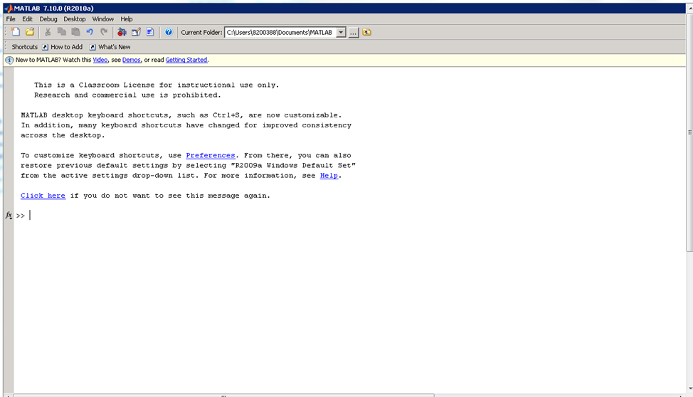
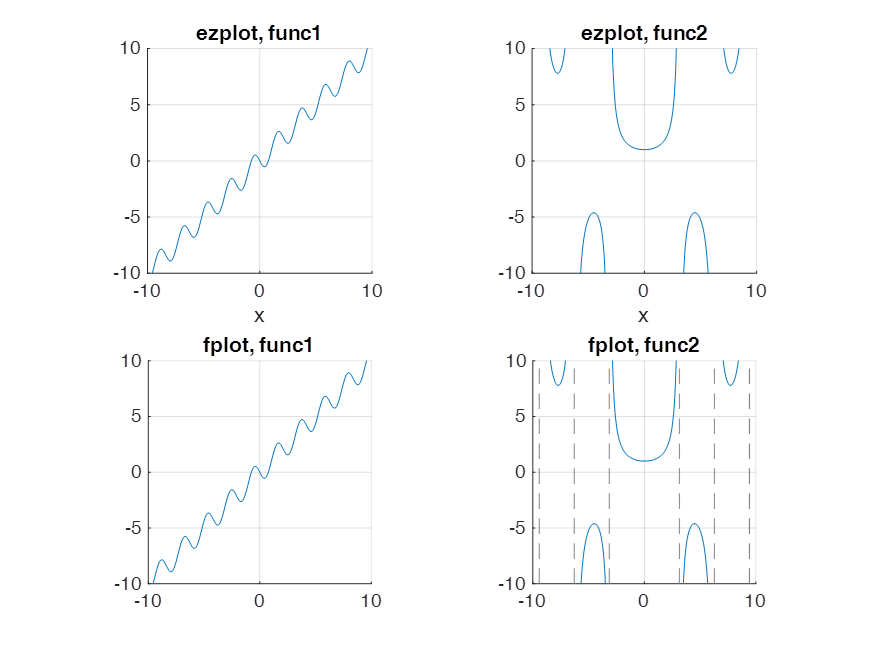
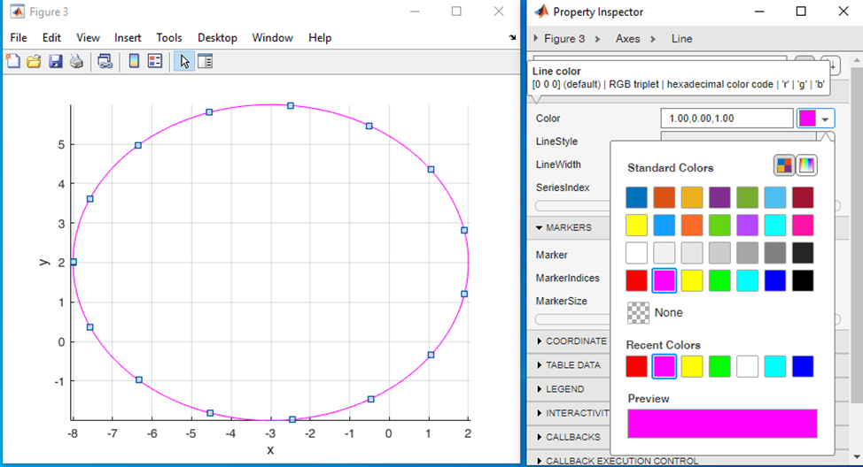
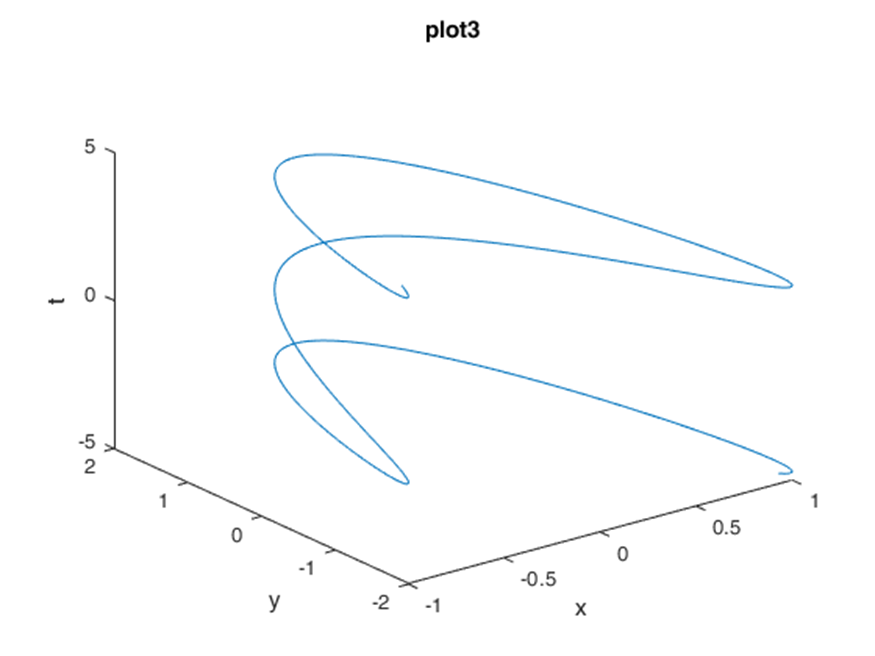

# Моделирование. Лабораторная работа 1.

1.  ## Упражнение 1.

    > Для расширения представления об интерфейсе и возможностях системы
    > выполните следующие задачи:
    >
    > в меню View отключите браузер рабочей области и прочие, не нужные
    > сейчас вам окна, для чего выберете View->Desktop layout->Command Window Only.

    

2.  ## Упражнение 2.

    > Вычислите значение выражения $\frac{\ln(\sin x\frac{\pi}{8}) + x^2 + \sqrt{2x - 2}}{2^y}$
    >
    > для
    > 1.  x = 1,001 , y = -10,7
    > 2.  x = 2 + 3i, y = 1 - i

    1.  **КОД**:

        ```Matlab
        func = @(x, y) (log(sin(x * pi / 8)) + x^2 + sqrt(2 * x - 2)) / 2 ^ y;

        display("1")
        display(func(1.001, -10.7))
        ```

        **OUTPUT**:

        ```
        "1"

        1.449280166540658e+02
        ```

    2.  **КОД**:

        ```matlab
        display("2")
        display(func(2 + 3 * i, 1 - i))
        ```

        **OUTPUT**:

        ```
        "2"

        -5.474451730751018 + 4.657488984156986i
        ```

3.  ## Упражнение 3.

    > 1.  Создайте вектор Х, элементы которого – члены арифметической
    >     прогрессии с начальным членом 5, шагом -3, состоящий из 4-х элементов.
    > 2.  Вычислите арктангенс его элементов.
    > 3.  Возведите его элементы в куб, возведите вектор в квадрат (скалярное умножение).

    1.  **КОД**:

        ```matlab
        progression = 5;

        for i = 2:4
          progression = [progression, progression(end) - 3];
        end

        display("Arithmetic progression:")
        display(progression)
        ```

        **OUTPUT**:

        ```
        "Arithmetic progression:"

        progression =

            5     2    -1    -4
        ```

    2.  **КОД**:

        ```matlab
        display("Arctan:")
        arctan = atan(progression);
        display(arctan)
        ```

        **OUTPUT**:

        ```
        "Arctan:"

        arctan =

            1.3734    1.1071   -0.7854   -1.3258
        ```

    3.  **КОД**:

        ```matlab
        cube = arctan .^ 3;
        display("Cube:")
        display(cube)

        dot_prod = dot(cube, cube);
        display("Dot product:")
        dot_prod
        ```

        **OUTPUT**:

        ```
        "Cube:"

        cube =

            2.5905    1.3571   -0.4845   -2.3305

        "Dot product:"

        dot_prod =

          14.2187
        ```

4.  ## Упражнение 4.

    > Создайте три матрицы
    >
    > A =
    > $$
    > \begin{matrix}
    > 1 & 2 & 3\\
    > 4 & 5 & 6\\
    > 7 & 8 & 9
    > \end{matrix}
    > $$
    >
    > B =
    > $$
    > \begin{matrix}
    > 2 & 6 & 8\\
    > 6 & 11 & 0.5
    > \end{matrix}
    > $$
    >
    > C =
    > $$
    > \begin{matrix}
    > 13 & 87 & 76 & 45 & 44
    > \end{matrix}
    > $$
    >
    > 1.  умножьте матрицу А на В. Что произошло?
    > 2.  объедините А и $В^T$ и C
    > 3.  из получившейся матрицы извлеките матрицу (3х3), находящуюся в левом верхнем углу;
    > 4.  удалите из матрицы, полученной в задании 2, четные строки и столбцы;
    > 5.  решите систему уравнений методом обратной матрицы:
    >     $$
    >     2x + 5y - 8z = 8\\
    >     5x + 6y + 3z = 12\\
    >     4x - 5y -z = 23
    >     $$

    Создание матриц:
    **КОД**:

    ```matlab
    A = [1 2 3; 4 5 6; 7 8 9];
    B = [2 6 8; 6 11 0.5];
    C = [13 87 76 45 44];
    ```

    1.  **КОД**:

        ```matlab
        A * B
        ```

        **OUTPUT**:

        ```
        Error using  *
        Incorrect dimensions for matrix multiplication.
        Check that the number of columns in the first matrix matches the
        number of rows in the second matrix. To operate on each element of the matrix individually,
        use TIMES (.*) for elementwise multiplication.

        Error in task3 (line 7)
        A * B

        Related documentation
        ```

        **ОТВЕТ**: Ошибка. Неправильная размерность матриц.

    2.  **КОД**:

        ```matlab
        mat_full = [[A B']; C];

        display("2. Combined A, B, C:")
        display(mat_full)
        ```

        **OUTPUT**:

        ```
        "2. Combined A, B, C:"

        mat_full =

            1.0000    2.0000    3.0000    2.0000    6.0000
            4.0000    5.0000    6.0000    6.0000   11.0000
            7.0000    8.0000    9.0000    8.0000    0.5000
          13.0000   87.0000   76.0000   45.0000   44.0000
        ```

    3.  **КОД**:

        ```matlab
        mat_small = mat_full(1:3, 1:3);

        display("3. 3 * 3 matrix extracted from the left upper corner:")
        display(mat_small)
        ```

        **OUTPUT**:

        ```
        "3. 3 * 3 matrix extracted from the left upper corner:"

        mat_small =

            1     2     3
            4     5     6
            7     8     9
        ```

    4.  **КОД**:

        ```matlab
        mat_combed = mat_full(2:2:end, 2:2:end);

        display("4. Even cols and rows removed:")
        display(mat_combed)
        ```

        **OUTPUT**:

        ```
        "4. Even cols and rows removed:"

        mat_combed =

            5     6
            87    45
        ```

    5.  **КОД**:

        ```matlab
        A = [2 5 -8; 5 6 3; 4 -5 -1];
        B = [8; 12; 23];

        X = inv(A) * B;

        display("5. matrix answer:")
        display(X)
        ```

        **OUTPUT**:

        ```
        "5. matrix answer:"

        X =

            4.1636
          -1.1354
          -0.6687
        ```

5.  ## Упражнение 5.

    > 1.  постройте графики $y = x - \sin(3x)$; $y = \frac{x}{\sin(x)}$ двумя способами.
    >     Для второго графика см. функцию fplot;
    > 2.  постройте $у=x*\sin(5x)$ в полярной СК, для х от 0 до 2pi и от -2pi до 2pi
    > 3.  постройте эллипс с центром координат (-3,2) большой полуосью 5, малой
    >     4, при помощи plot, ezplot;
    > 4.  посмотрите в меню tools и edit, что можно сделать с графиком, поменяйте его цвет,
    >     назовите оси координат

    1.  **КОД**:

        ```matlab
        func1 = @(x) x - sin(3 * x);
        func2 = @(x) x / sin(x);

        % START func1
        subplot(2, 2, 1)

        hold on, grid on, axis equal

        x_lim = [-10 10];

        ezplot('x - sin(3 * x)', x_lim)
        title('ezplot, func1')

        xlim(x_lim)
        ylim(x_lim)

        subplot(2, 2, 3)

        hold on, grid on, axis equal

        fplot(func1, x_lim)
        title('fplot, func1')

        xlim(x_lim)
        ylim(x_lim)

        % END func1

        % START func2
        subplot(2, 2, 2)

        hold on, grid on, axis equal

        ezplot('x / sin(x)', x_lim)
        title('ezplot, func2')

        xlim(x_lim)
        ylim(x_lim)

        subplot(2, 2, 4)

        hold on, grid on, axis equal

        fplot(func2, x_lim)

        xlim(x_lim)
        ylim(x_lim)

        title('fplot, func2')
        % END func2
        ```

        **OUTPUT**:

        
    2.  **КОД**:

        ```matlab
        % START func3
        figure
        subplot(1, 2, 1)
        hold on, grid on, axis equal
        func3 = 'x * sin(5*x)';
        x_lim1 = [0, 2 * pi]; 
        x_lim2 = [-2 * pi, 2 * pi]; 

        ezpolar(func3, x_lim1)

        title('0 : 2pi')
        subplot(1, 2, 2)

        ezpolar(func3, x_lim2)

        title('-2pi : 2pi')
        % END func3
        ```

        **OUTPUT**:

        
    3.  **КОД**:

        ```matlab
        % Ellipse
        figure
        hold on, grid on, axis equal

        a = 5;
        b = 4;

        x1 = -3; y1 = 2;
        t = -pi:0.01:pi;
        x = x1 + (a * cos(t));
        y = y1 + (b * sin(t));
        plot(x, y);
        ```

        **OUTPUT**:

        
    4.  

6.  ## Упражнение 6.

    > 1.  постройте график функции $y=f(x)$, где $x=\sin(t)$, $y=2*\cos(2t)$, $-5<t<5$;
    > 2.  постройте график функции $z = \frac{x^2 + y^2}{5 \times x \times y} + \ln(x + y)$
    >     для $0 < x < 3; 0 < y < 3;$

    1.  **КОД**:

        ```matlab
        t = -4.9:0.01:4.9;
        x = sin(t);
        y = 2 * cos(2 * t);

        plot3(x, y, t)
        title('plot3')
        xlabel('x')
        ylabel('y')
        zlabel('t')
        ```

        **OUTPUT**:

        
    2.  **КОД**:

        ```matlab
        func = '(x ^ 2 + y ^ 2) / (5 * x * y) + log(x + y)';

        ezsurf(func, [0 3 0 3])
        ```

        **OUTPUT**:

        

7.  ## Упражнение 7.

    > 1.  Самостоятельно изучить операторы циклов for, while, if, switch.
    >     Привести примеры их использования.
    > 2.  Написать функцию, которая считает факториал своего параметра,
    >     если введено отрицательное число, должно выдаваться сообщение об ошибке.
    >
    >     Подсказка: требуемая функция может выглядеть следующим образом calc_fact(n);
    >     также смотри help disp
    > 3.  Написать функцию, которая считает сумму ряда: $f_n=\frac{1}{n^{(N+1)}}$, где N – номер
    >     варианта, с заданной точностью (точность вводит пользователь).
    >
    >     Подсказка: смотри help input.

    1.  **КОД**:

        ```matlab
        for i = 1:3
          fprintf('for hello %d\n', i)
        end

        i = 0;

        display("")

        while i < 3
          i = i + 1;
          fprintf('while hello %d\n', i)
        end

        if i == 3
          display("if hello")
        end

        switch i
          case 3
            display("switch hello")
          otherwise
            display("switch otherwise hello")
        end
        ```

        **OUTPUT**:

        ```
        for hello 1
        for hello 2
        for hello 3
            ""

        while hello 1
        while hello 2
        while hello 3
            "if hello"

            "switch hello"
        ```

    2.  Факториал
        *   Функция *factorial*:

            **КОД**

            ```matlab
            function out = factorial(n)
              if n < 0
                error('Factorial of a negative number.')
              end

              out = 1;

              for mult = n:-1:1
                out = out * mult;
              end
            end
            ```

        *   *main*:

             Проверка на отрицательные числа:

            **КОД**:

            ```matlab
            factorial(-1)
            ```

            **OUTPUT**:

            ```
            Error using factorial
            Factorial of a negative number.

            Error in task6 (line 27)
            factorial(-1)
            ```

            Нормальный workflow:

            **КОД**:

            ```matlab
            assert(factorial(0) == 1, "Error")
            assert(factorial(1) == 1, "Error")
            assert(factorial(2) == 2, "Error")
            assert(factorial(3) == 6, "Error")
            assert(factorial(4) == 24, "Error")

            display("factorial check is passed")
            ```

            **OUTPUT**:

            ```
            "factorial check is passed"
            ```

      3.  Сумма ряда
          *   Функция *series_sum*:

              **КОД**:

              ```matlab
              function summa = series_sum(precision, var)

                func = @(n) 1 / n ^ (var + 1);

                n = 1;
                summa = 0;

                previous = func(n);

                summa = previous;

                n = n + 1;

                current = func(n);

                while abs(current - previous) > precision
                  n = n + 1;
                  summa = summa + current;

                  previous = current;

                  current = func(n);
                end
              end
              ```
          
          *   *main*:

              **КОД**:

              ```matlab
              format long
              var = 16;
              precision = input("Input precision: ");
              series_sum(precision, var)
              ```

              **OUTPUT**:

              ```
              Input precision: 10 ^ -10

              ans =

                1.000007637196263
              ```
