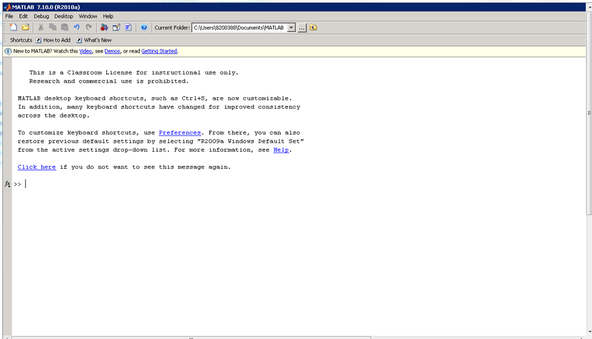

# Моделирование. Лабораторная работа 1.

1.  ## Упражнение 1.

    > Для расширения представления об интерфейсе и возможностях системы
    > выполните следующие задачи:
    >
    > в меню View отключите браузер рабочей области и прочие, не нужные
    > сейчас вам окна, для чего выберете View->Desktop layout->Command Window Only.

    

2.  ## Упражнение 2.

    > Вычислите значение выражения $\frac{\ln(\sin x\frac{\pi}{8}) + x^2 + \sqrt{2x - 2}}{2^y}$
    >
    > для
    > 1.  x = 1,001 , y = -10,7
    > 2.  x = 2 + 3i, y = 1 - i

    1.  **КОД**:

        ```matlab
        func = @(x, y) (log(sin(x * pi / 8)) + x^2 + sqrt(2 * x - 2)) / 2 ^ y;

        display("1")
        display(func(1.001, -10.7))
        ```

        **OUTPUT**:

        ```
        "1"

        1.449280166540658e+02
        ```

    2.  **КОД**:

        ```matlab
        display("2")
        display(func(2 + 3 * i, 1 - i))
        ```

        **OUTPUT**:

        ```
        "2"

        -5.474451730751018 + 4.657488984156986i
        ```
2.  ## Упражнение 3.

    > 1.  Создайте вектор Х, элементы которого – члены арифметической
    >     прогрессии с начальным членом 5, шагом -3, состоящий из 4-х элементов.
    > 2.  Вычислите арктангенс его элементов.
    > 3.  Возведите его элементы в куб, возведите вектор в квадрат (скалярное умножение).

    1.  **КОД**:

        ```matlab
        progression = 5;

        for i = 2:4
          progression = [progression, progression(end) - 3];
        end

        display("Arithmetic progression:")
        display(progression)
        ```

        **OUTPUT**:

        ```
        "Arithmetic progression:"

        progression =

            5     2    -1    -4
        ```

    2.  **КОД**:

        ```matlab
        display("Arctan:")
        arctan = atan(progression);
        display(arctan)
        ```

        **OUTPUT**:

        ```
        "Arctan:"

        arctan =

            1.3734    1.1071   -0.7854   -1.3258
        ```

    3.  **КОД**:

        ```matlab
        cube = arctan .^ 3;
        display("Cube:")
        display(cube)

        dot_prod = dot(cube, cube);
        display("Dot product:")
        dot_prod
        ```

        **OUTPUT**:

        ```
        "Cube:"

        cube =

            2.5905    1.3571   -0.4845   -2.3305

        "Dot product:"

        dot_prod =

          14.2187
        ```

3.  ## Упражнение 4.

    > Создайте три матрицы
    > 
